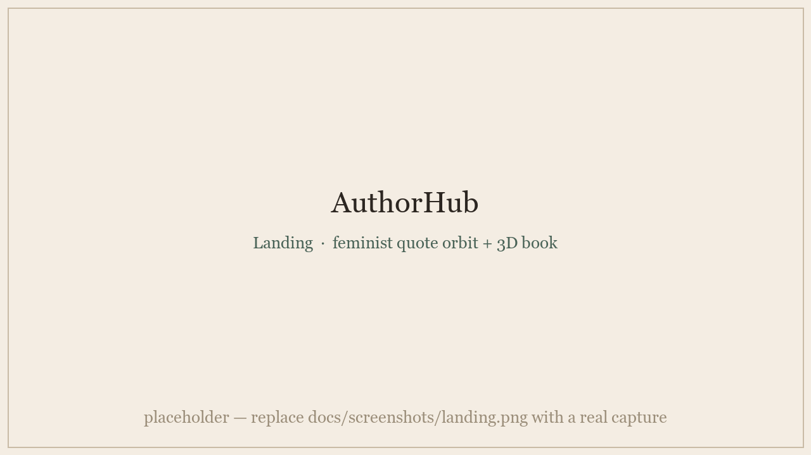
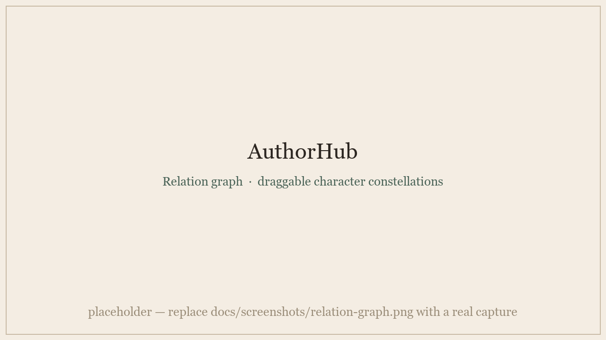

<div align="center">

# 📖 AuthorHub

### A privacy-first, feminist creative command center for fiction writers
### 一个隐私优先、以女性主义为底色的虚构写作中台

[**🌐 Live · authorhub.cn**](https://authorhub.cn) &nbsp;·&nbsp; [**English**](#-english) &nbsp;·&nbsp; [**简体中文**](#-简体中文)

[](https://authorhub.cn)


*A warm, manuscript-first workspace that turns scattered characters, relationships, timelines and worldbuilding into one living atlas — opening with the voices of women writers across four centuries, wrapped in a **Midnight Jazz Cafe** aesthetic of cream paper and Morandi ink.*

</div>

---

## 📸 A look inside

<p align="center">
  
</p>
<p align="center">
  
  &nbsp;
  
</p>

<div align="center"><sub>Screenshots are placeholders for now — real captures live in <a href="docs/screenshots/">docs/screenshots/</a>.</sub></div>

---

## 🌟 English

### ✊ A feminist front door

AuthorHub doesn't open with a login box — it opens with a sky of drifting, typewriter-style quotes, **every one from a woman writer**: Virginia Woolf's *"A woman must have money and a room of her own,"* Charlotte Brontë's *"I am no bird; and no net ensnares me,"* alongside Jane Austen, the Brontë sisters, Mary Shelley, George Eliot, Emily Dickinson, Louisa May Alcott, Elizabeth Barrett Browning, Toni Morrison, Ursula K. Le Guin, and Chimamanda Ngozi Adichie.

That choice is the point. AuthorHub is built as **a room of one's own for storytellers** — a private, self-owned writing home that foregrounds women's literary voices and treats a writer's drafts as theirs alone. The feminism isn't a banner; it's the threshold you walk through every time you enter.

### 📚 What it is

Most writing tools are either a blank linear page or a cold enterprise dashboard. AuthorHub is built for the *messy, interconnected reality of fiction*: characters who pull at each other, timelines that branch, settings that must stay consistent across hundreds of thousands of words — all in a space calm enough to live in during long writing sessions.

It turns scattered notes into an **editable atlas** of your story universe: novels, outlines, settings, themes, a force-directed character-relationship graph, character detail cards, a timeline, reference images, and exportable data — behind a privacy-first auth wall, with offline-first local storage so your work survives a dropped connection.

### ✨ Features

| | Feature |
|---|---|
| ✊ | **Feminist landing** — a cinematic, animated orbit of quotes drawn entirely from women writers; a deliberate statement, not decoration. |
| 🎬 | **Procedural 3D book opener** — a `three.js` book you drag open to enter your studio. The cover is generated in code — no stock image. |
| 🌌 | **Force-directed relationship graph** — `D3`-powered character "planets" you can drag around a star-map, with **inline-editable relationship labels**, protagonist aura, tag badges, and focus isolation that dims everything but the selected character's connections. |
| 🧑‍🎤 | **Adaptive character cards** — image carousel, custom tags, a Morandi color picker per character, a long-form background field, and a private *hidden-setting* field for secrets only the author should know. |
| 🗂️ | **Drag-to-reorder novels** — reorder manuscripts in the sidebar with a smooth `SortableJS` row-drag; the new order persists through the save flow. |
| 🕰️ | **Timeline workspace** — a horizontal slider of event cards, each with date, background, plot beats, and reference media. |
| 🤖 | **One-click AI handoff** — copies a structured prompt about the current scene and opens **ChatGPT / DeepSeek / Claude** to help with research, worldbuilding consistency, and plot-hole hunting. |
| 🎷 | **Floating jazz player** — a draggable, collapsible, cross-page music companion for deep-work sessions. |
| 🌗 | **Calm & configurable** — day/night mode that persists, adjustable reading font family & size, and a one-key **privacy blur** (press `Esc`) that instantly fogs the screen when someone walks by. |
| 💾 | **Yours to keep** — works offline via `localStorage`, syncs to the cloud when available, and exports your entire universe to **JSON or Markdown** at any time, plus a full data-clear control. |

### 🎨 Design — "Midnight Jazz Cafe"

A deliberately literary, low-saturation visual language: cream paper texture, Morandi ink tones, serif editorial rhythm, soft physical shadows, and compact, high-density SaaS spacing. Cards are warm and tactile rather than cold and metallic; dark mode is a set of muted *companion* colors, not a black skin. Motion is restrained — a soft paper-lift on hover, a gentle press on click — so the interface stays readable through long sessions.

### 🧱 Tech stack

`React 19` · `Vite 8 (Rolldown)` · `D3.js` (relationship graph) · `three.js / React-Three-Fiber` (3D book) · `SortableJS` (drag reorder) · `Supabase` (auth + Postgres with row-level security) · `lucide-react` (icons). Heavy 3D / graph code is route-split and lazy-loaded so the first paint stays light.

### 🛡️ Privacy by design

An auth wall gates the app before any private data loads. Drafts live in your own account; when the cloud is unreachable the app falls back to local storage and keeps working. Image uploads run client-side with a 5 MB guard, exports are one click, and a full data-clear is always available. Private draft formats are ignored by `.gitignore` by default.

### 🚀 Run it locally

```bash
git clone https://github.com/bhsversion7-byte/Authorhub.git
cd Authorhub
npm install
npm run dev      # http://localhost:6173
```

With no backend configured, AuthorHub runs in a **local demo mode** — a built-in offline auth flow plus seeded sample data — so you can explore every screen immediately.

### 💌 Feedback & License

Creator feedback and story-structure ideas are welcome: [bhsversion@163.com](mailto:bhsversion@163.com?subject=AuthorHub_Feedback)

Released under the **MIT License**.

---

## 🪶 简体中文

### ✊ 以女性主义作为入口

AuthorHub 的首页不是一个登录框，而是一片缓缓漂浮、打字机质感的引言星空——**每一句都出自女性作家之口**：弗吉尼亚·伍尔夫的「女性需要金钱，也需要一间自己的房间」、夏洛蒂·勃朗特的「我不是飞鸟，也没有罗网能困住我」，以及简·奥斯汀、勃朗特姐妹、玛丽·雪莱、乔治·艾略特、艾米莉·狄金森、露易莎·梅·奥尔科特、伊丽莎白·巴雷特·勃朗宁、托妮·莫里森、厄休拉·勒古恩、奇玛曼达·恩戈兹·阿迪契。

这是刻意的选择。AuthorHub 想成为讲故事的人「**一间自己的房间**」——一个私密、归属于创作者自身的写作家园，让女性的文学声音站在最前面，也让作者的草稿只属于作者。女性主义不是一句口号横幅，而是你每一次进入时都要走过的那道门槛。

### 📚 这是什么

大多数写作工具，要么是一张线性的空白文档，要么是一块冰冷的企业后台。AuthorHub 为虚构创作*那种纷繁交织的真实*而生：人物彼此牵引、时间线不断分叉、设定要在几十万字里保持自洽——而这一切都被收进一个足够安静、可以长时间停留的空间。

它把零散的笔记变成一张可编辑的**故事宇宙地图**：小说、大纲、设定、主题、力导向人物关系图、人物详情卡、时间线、参考图与可导出数据——全部置于隐私优先的门禁之后，并以本地优先的存储保证断网也不丢稿。

### ✨ 功能一览

| | 功能 |
|---|---|
| ✊ | **女性主义首页** —— 全部取自女性作家的引言，以电影感的动态星空浮现；这是有意的表达，而非装饰。 |
| 🎬 | **程序化 3D 翻书入场** —— 用 `three.js` 渲染、可拖动翻开进入工作室的书；封面由代码生成，不依赖任何图片素材。 |
| 🌌 | **力导向关系星图** —— `D3` 驱动的人物「星球」可在星图上自由拖拽，**关系标签可直接在图上编辑**，含主角光环、标签徽章，以及聚焦隔离（只突出选中人物的关系，其余淡出）。 |
| 🧑‍🎤 | **自适应人物卡** —— 图片轮播、自定义标签、每个角色独立的莫兰迪取色器、长篇背景字段，以及只属于作者的私密「隐藏设定」字段。 |
| 🗂️ | **小说拖拽排序** —— 用顺滑的 `SortableJS` 行拖拽在侧栏重排作品，新顺序经由保存流程持久化。 |
| 🕰️ | **时间线工作区** —— 横向滑动的事件卡片，每张包含时间、背景、剧情节点与参考图。 |
| 🤖 | **一键 AI 接力** —— 自动整理当前场景为结构化提示词，并打开 **ChatGPT / DeepSeek / Claude**，辅助考据、世界观自洽与逻辑漏洞排查。 |
| 🎷 | **悬浮爵士播放器** —— 可拖拽、可收起、跨页面的音乐伴侣，陪你进入深度写作。 |
| 🌗 | **安静且可配置** —— 可持久化的日间/夜间模式、可调的阅读字体与字号，以及一键 **隐私模糊**（按 `Esc`），有人路过时瞬间为屏幕蒙上一层雾。 |
| 💾 | **创作归你所有** —— 离线时用 `localStorage` 工作，联网时同步云端，可随时把整个宇宙导出为 **JSON 或 Markdown**，并提供一键清空数据。 |

### 🎨 设计——「午夜爵士咖啡馆」

一套刻意文学化、低饱和度的视觉语言：奶油纸张质感、莫兰迪墨色、衬线编辑韵律、柔和的物理阴影，以及紧凑而高密度的 SaaS 间距。卡片温润、有触感，而非冰冷金属；夜间模式是一组克制的「同色系伙伴色」，而非纯黑换肤。动效克制——悬停时如纸张轻抬，点击时轻轻下压——让界面在长时间写作中始终易读。

### 🧱 技术栈

`React 19` · `Vite 8（Rolldown）` · `D3.js`（关系图） · `three.js / React-Three-Fiber`（3D 书） · `SortableJS`（拖拽排序） · `Supabase`（认证 + 带行级安全的 Postgres） · `lucide-react`（图标）。沉重的 3D / 图计算代码按路由拆分并懒加载，让首屏保持轻盈。

### 🛡️ 隐私即设计

进入界面前先过认证门禁，任何私密数据都在其后才加载。草稿归属于你自己的账号；云端不可用时自动回落到本地存储继续工作。图片上传在客户端完成并有 5MB 保护，导出一键可达，清空数据随时可用。私密草稿格式默认被 `.gitignore` 忽略。

### 🚀 本地运行

```bash
git clone https://github.com/bhsversion7-byte/Authorhub.git
cd Authorhub
npm install
npm run dev      # http://localhost:6173
```

未配置后端时，AuthorHub 会进入**本地演示模式**——内置离线认证流程并预置示例数据——你可以立即浏览每一个界面。

### 💌 反馈与许可

欢迎创作者反馈与故事结构建议：[bhsversion@163.com](mailto:bhsversion@163.com?subject=AuthorHub_Feedback)

基于 **MIT 许可证** 发布。

<div align="center">

---

*A room of one's own, for storytellers. 为讲故事的人，一间自己的房间。* ✍️

[⬆️ Back to top](#-authorhub)

</div>
