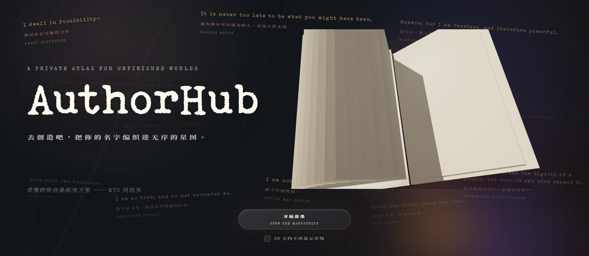
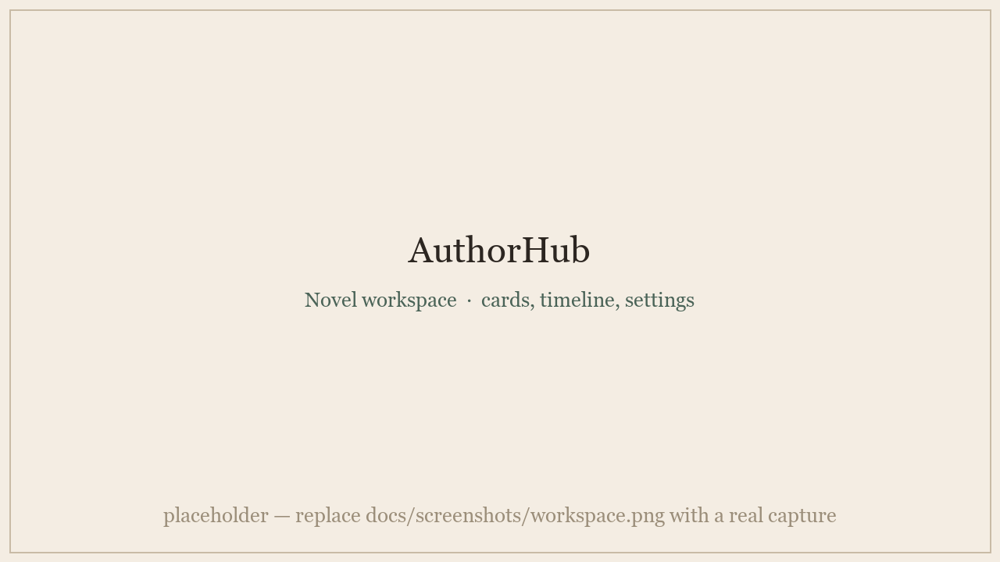

# AuthorHub · 落墨

**写作者的私人手稿星图。**
不是文本编辑器，也不是后台面板，而是一张安静的创作桌——小说、大纲、设定集、人物、时间线、参考图，都放在同一个工作区里。

[**✦ 打开在线应用 → authorhub.cn**](https://authorhub.cn)

[English](./README.md) · **简体中文**

 

  

---

## ✦ 为什么做它

很多小说，不是只靠一份正文就能被管理好的。

写到中后期，人物关系会变复杂，时间线会开始互相打架，设定会散落在聊天记录、备忘录、文档和脑子里。AuthorHub 想解决的正是这种很真实的混乱：让写作者在**不离开创作状态**的情况下，把故事结构看清楚，也把私人草稿保护好。

界面刻意保持温和、纸质、低打扰。功能可以复杂，但使用时不应该像在操作一套冷冰冰的企业系统。

  

## ✨ 主要功能

| | |
|---|---|
| 📚 **多本小说工作区** | 每本小说都有独立的大纲、设定、标签、封面色和发布链接。 |
| 🌌 **人物关系星图** | 基于 D3 的力导向图：可拖拽节点、聚焦/重置、主角居中、关系标签，主角关系线高亮。按住 Shift 拖框选中几颗星球、右键「锁定位置」即可固定排布，新增人物也不会打乱它们。 |
| 🧑‍🎨 **丰富的人物卡片** | 图片、年龄、身份、**可多选标签**、背景故事，以及只有你能看到的隐藏设定。 |
| 🕰️ **交互式时间线** | 拖拽事件按剧情节奏排序，而不只是按日期。 |
| 🏷️ **主题标签与参考** | 主题标签、世界设定、参考图片、文本卡片集中一处，都支持拖拽排序。 |
| 🖋️ **专注编辑器** | 把大纲/设定集放大成沉浸式全屏视图，长文可按小标题分页浏览，支持编辑器内搜索和实时字数统计。 |
| 🔗 **分享与协作** | 生成共同编辑或只读查看链接，随时可以撤回，还能看到当前正在一起编辑的协作者；读者只能看到你选择公开的模块。 |
| 🛡️ **服务端隐私裁剪** | 只读分享在**服务端**移除隐藏/私密字段与作者身份链接，而不只是前端隐藏。 |
| 📤 **导出你的数据** | 一键导出 JSON 与 Markdown，让你的资料始终属于自己。 |
| ☁️ **云端同步 + 本地兜底** | 登录后编辑同步到 Supabase，并保留即时本地缓存，崩溃或断网都不丢稿。 |
| 🎐 **一点小惊喜** | 落地页的电影级 3D 书、悬浮的爵士乐播放器、飘动的文学引言，以及阅读字体设置。 |

## 🎨 设计气质

AuthorHub 的方向是**安静、文学感、可长时间停留**。

我们更喜欢纸张纹理、柔和的莫兰迪色、清楚的按钮状态和稳定的布局；不追求夸张动画，也不希望界面抢走故事本身的注意力。它应该像一张被认真使用过的写作桌，而不是一个为了展示技术而存在的页面。

## 🔒 隐私与数据

AuthorHub 默认把草稿当成私密数据处理。

- 工作区需要登录后访问；小说文档按用户隔离，并由 **Supabase 行级安全策略（RLS）** 守护。
- 分享链接基于 token，不会公开你的整个工作区。
- 只读分享会移除 `secret` / `hidden` / `privateNote` 字段**以及**作者身份平台链接，全部在服务端裁剪。
- 图片会迁移到 Supabase Storage，避免大图长期塞在主文档里。
- 本地手稿缓存会在**退出登录与注销账号**时清除，在公共电脑上登出后不留痕迹。
- 单次云端加载失败，也绝不会让过期的兜底数据覆盖你真实的云端文档。

## 🧱 技术组成

- **React 19 + Vite 8** —— 应用外壳与构建。
- **Supabase** —— 认证、Postgres、行级安全策略与存储。
- **D3.js** —— 力导向人物关系星图。
- **Three.js / React Three Fiber** —— 落地页电影级 3D 书。
- **SortableJS** —— 小说、时间线事件与标签的拖拽排序。
- **lucide-react** —— 图标库。
- **Cloudflare Turnstile** —— 叠加在自托管数字验证码之上的可选人机验证。

## 🚧 项目状态

AuthorHub 仍在持续、认真地精修中。当前重点是让核心写作体验更稳：分享权限、云端保存、移动端触摸、人物星图性能、时间线排序与导出备份都会继续被打磨。

如果你正在使用它，真实写作中遇到的不顺手之处就是最宝贵的反馈——小问题也很重要，因为这个工具本来就是为长时间、反复使用而做的。

## 💬 反馈

问题、建议、使用感受都可以发到：

**[bhsversion@163.com](mailto:bhsversion@163.com?subject=AuthorHub_Feedback)**

 
写给那些把整个世界装在脑子里的写作者 —— <a href="https://authorhub.cn">authorhub.cn</a>

